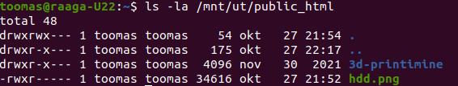
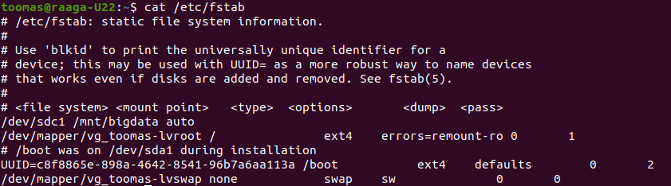

1. Miks andmekandjad vajavad lähtestamist? (sisukas vastus võiks omada põhjendust)
   
   **Kui lisada andmekandja arvutile siis seda esialgu ei kuvata failiuurijas. Selle jaoks, et see kuvaks ja seda kasutada saaks siis tuleb andmekandja lähtestada.**
2. Millised on GPT kasutamise eelised ja puudused võrreldes MBR'iga? (välja tuua vähemalt 3 eelist)
   
   **GPT võimaldab teha rohkem jaotusi(128) kui MBR(26). MBR-il on parem tarkvaraline kui ka riistvaraline ühilduvus seadmetega kui GPT. MBR tabelite maht on maksimaalselt 2TB mis on vahem kui GPT tabelitel.**
3. Lisage link `https://kodu.ut.ee/~TÜ_kasutajatunus/hdd.png` praktikumi aruandesse tõestuseks, et olete Ülesande `TÜ võrguketta haakimine Windowsis` edukalt lahendanud.
   
   **https://kodu.ut.ee/~traaga/hdd.png**
4. Lisage `ls -la /mnt/ut/public_html` käsu väljundi pilt aruandesse
   
   
5. Mida mõjutasid `mount` käsu parameetrid "`-o ro`" ja "`-t auto`"?
   
   **-o ro : Paigaldab ainult lugemisõigustega**
   
   **-t auto : Automaatselt leiab failisüsteemi tüübi**
6. `mount` käsu väljundist leidke üles, mis väärtusega Ubuntu asendas `auto` parameetri?
   
   **NTFS**
7. Tehke ekraanipilt `/etc/fstab` faili sisust pärast iseseisva ülesande lahendamist (või muu tõestus/seadistamise juhend, et 4TB ketas haagitaks automaatselt kausta `/mnt/bigdata` Ubuntu käivitamisel).
   
   

